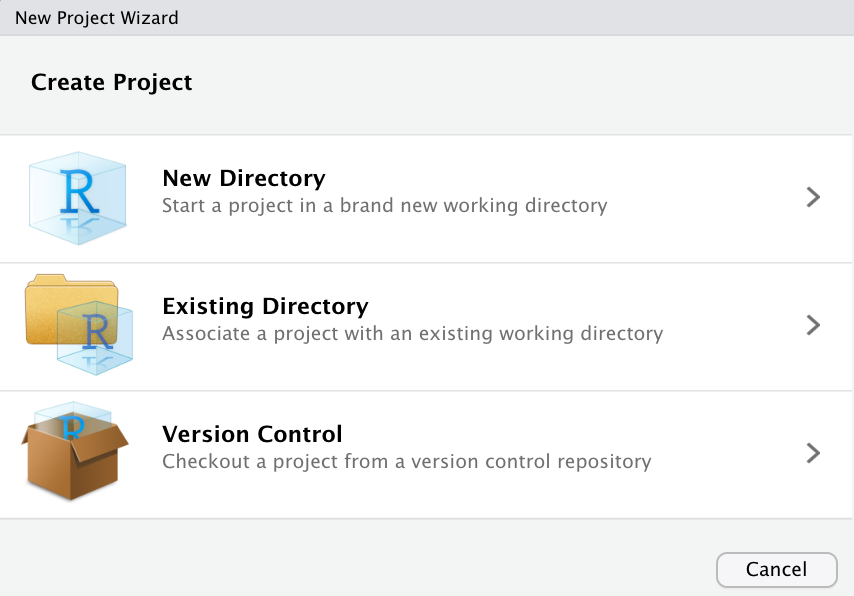
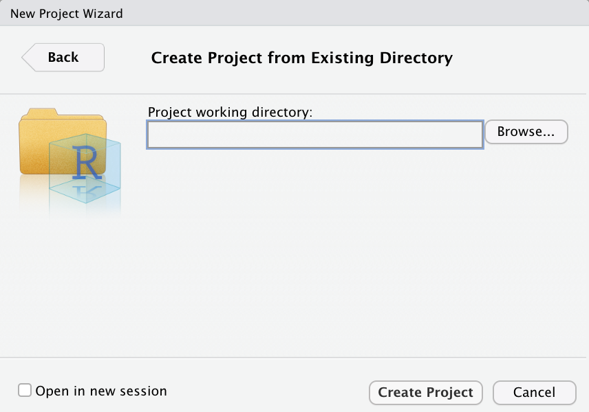
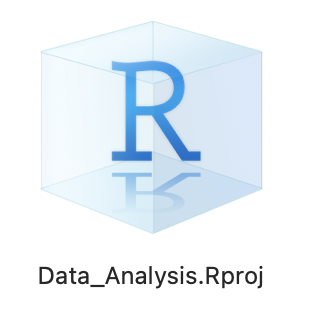

# `R` et `RStudio` : les bases {#sec-basics}


## Préambule

Avant de commencer à explorer des données dans `R`, il y a plusieurs concepts clés qu'il faut comprendre en premier lieu :

1. Que sont `R` et `RStudio` ?
2. Comment s'y prend-on pour coder dans `R` ?
3. Que sont les `packages` ?

Même si vous pensez être déjà à l'aise avec ces concepts, lisez attentivement ce chapitre et faites les exercices demandés. Cela vous rafraîchira probablement la mémoire, et il n'est pas impossible que vous appreniez une chose ou deux au passage. Une bonne maîtrise des éléments présentés dans ce chapitre est indispensable pour aborder sereinement les chapitres suivants, à commencer par le @sec-dataset, qui présente un jeu de données que nous explorerons en détail un peu plus tard. Lisez donc attentivement ce chapitre et faites bien tous les exercices demandés. 

Ce chapitre est en grande partie basé sur les 2 ressources suivantes que je vous encourage à consulter si vous souhaitez obtenir plus de détails :

1. L'ouvrage intitulé [ModernDive](https://moderndive.com/index.html), de Chester Ismay et Albert Y. Kim. Une bonne partie de ce livre est très largement inspirée de cet ouvrage. C'est en anglais, mais c'est un très bon texte d'introduction aux statistiques sous `R` et `RStudio`.
2. L'ouvrage intitulé [Getting used to R, RStudio, and R Markdown](https://ismayc.github.io/rbasics-book/) de Chester Ismay, comprend des podcasts (en anglais toujours) que vous pouvez suivre en apprenant.
<!-- 3. Les tutoriels en ligne de [DataCamp](https://datacamp.com/). DataCamp est une plateforme de e-learning accessible depuis n'importe quel navigateur internet et dont la priorité est l'enseignement des "data sciences". Leurs tutoriels vous aideront à apprendre certains des concepts de développés dans ce livre. 

:::{.callout-important}
Avant d'aller plus loin, rendez-vous sur [le site de DataCamp](https://www.datacamp.com/), créez-vous un compte gratuit, et reprenez la lecture de ce livre.
::: -->


## Que sont `R` et `RStudio` ?

Pour l'ensemble de ces TP, j'attends de vous que vous utilisiez `R` *via* `RStudio`. Les utilisateurs novices confondent souvent les deux. Pour tenter une analogie simple :

- `R` est le moteur d'une voiture
- `RStudio` est l'habitacle, le tableau de bord, les pédales...

Si vous n'avez pas de moteur, vous n'irez nulle part. En revanche, un moteur sans tableau de bord est difficile à manœuvrer. Il est en effet beaucoup plus simple de faire avancer une voiture depuis l'habitacle, plutôt qu'en actionnant à la main les câbles et leviers du moteur.

En l'occurrence, `R` est un langage de programmation capable de produire des graphiques et de réaliser des analyses statistiques, des plus simples aux plus complexes. `RStudio` est un "emballage" qui rend l'utilisation de `R` plus aisée. `RStudio` est ce qu'on appelle un IDE ou "Integrated Development Environment". On peut utiliser `R` sans `RStudio`, mais c'est nettement plus compliqué, nettement moins pratique.


### Installation {#sec-install}

:::{.callout-warning}
Si vous travaillez exclusivement sur les ordinateurs de l'Université, vous pouvez passer cette section. En revanche, si vous souhaitez utiliser `R` et `RStudio` sur votre ordinateur personnel, alors lisez attentivement la suite !
:::

Avant tout, vous devez télécharger et installer `R`, **puis** `RStudio`, dans cet ordre :

1. [Téléchargez et installez `R`](https://cran.r-project.org)
 - Vous devez installer ce logiciel en premier.
 - Cliquez sur le lien de téléchargement qui correspond à votre système d'exploitation, puis, sur "base", si vous êtes sous Windows, sur "`R-4.4.1-x86_64.pkg`" si vous êtes sous Mac avec processeur Intel, ou sur `R-4.4.1-arm64.pkg` si vous êtes sous Mac avec processeur M1 ou M2 (sous Mac, cliquez sur le Menu , puis sur "À propos de ce Mac" et regardez à la rubrique "Processeur"), et suivez les instructions.
2. [Téléchargez et installez `RStudio`](https://www.rstudio.com/products/RStudio/#Desktop)
 - Cliquez sur "RStudio Desktop", puis sur "Download RStudio Desktop".
 - Choisissez la version gratuite et cliquez sur le lien de téléchargement qui correspond à votre système d'exploitation.
 

### Utiliser `R` depuis `RStudio`

Puisqu'il est beaucoup plus facile d'utiliser `Rstudio` pour interagir avec `R`, nous utiliserons exclusivement l'interface de `RStudio.` Après les installations réalisées à la @sec-install, vous disposez de 2 nouveaux logiciels sur votre ordinateur. `RStudio` ne peut fonctionner sans `R`, mais nous travaillerons exclusivement dans `RStudio` :

- `R`, ne pas ouvrir ceci : 
<br>
<br>
- `RStudio`, ouvrir cela : {fig-width=28%}

À l'université, vous trouverez `RStudio` dans le menu Windows, à condition d'être connecté à la machine virtuelle `bio`. Quand vous ouvrez `RStudio` pour la première fois, vous devriez obtenir une fenêtre qui ressemble à ceci :


Prenez le temps d'explorer cette interface, cliquez sur les différents onglets, ouvrez les menus, allez faire un tour dans les préférences du logiciel pour découvrir les différents panneaux de l'application, en particulier la Console dans laquelle nous exécuterons très bientôt du code `R`.


## Comment exécuter du code `R` ? {#sec-code}

Contrairement à d'autres logiciels comme Excel, STATA ou SAS qui fournissent des interfaces où tout se fait en cliquant avec sa souris, `R` est un langage interprété, ce qui signifie que vous devez taper des commandes, écrites en code `R`. C'est-à-dire que vous devez **programmer** en `R` (j'utilise les termes "coder" et "programmer" de manière interchangeable dans ce livre). 

Il n'est pas nécessaire d'être un programmeur pour utiliser `R`, néanmoins, il est nécessaire de programmer ! Il existe en effet un ensemble de concepts de programmation de base que les utilisateurs de `R` doivent comprendre et maîtriser. Et progresser en programmation vous permettra d'automatiser de plus en plus de choses, et donc, à terme, de gagner beaucoup de temps. Par conséquent, bien que ce livre ne soit pas un livre sur la programmation, vous en apprendrez juste assez en programmation pour explorer et analyser efficacement des données.

### La console

La façon la plus simple d'interagir avec `RStudio` (mais pas du tout la meilleure !) consiste à taper directement des commandes que `R` pourra comprendre **dans la Console**.

Cliquez dans la console (après le symbole `>`) et tapez ceci, sans oublier de valider en tapant sur la touche `Entrée` :

```{r}
3 + 8
```

Félicitations, vous venez de taper votre première instruction `R` : vous savez maintenant faire des additions !

Dans la version en ligne de ce livre (en html), à chaque fois que du code `R` sera fourni, il apparaîtra dans un cadre grisé avec une ligne bleue à gauche, comme ci-dessus. Vous pourrez toujours taper dans `RStudio`, les commandes qui figurent dans ces blocs de code, afin d'obtenir vous même les résultats souhaités. Dans ce livre, lorsque les commandes `R` produisent des résultats, ils sont affichés juste en dessous des blocs de code. Enfin, en passant la souris sur les blocs de code, vous verrez apparaître, à droite, une icône de presse-papier qui vous permettra de copier-coller les commandes du livre dans la console de `RStudio` ou, très bientôt, dans vos scripts. 

:::{.callout-warning}
## Les risques du "copier-coller" []{style="color: orange"}

Attention : il est fortement conseillé de réserver les copier-coller aux blocs de commandes de (très) grande taille, ou en cas d'erreur de syntaxe inexplicable. L'expérience a en effet montré qu'**on apprend beaucoup mieux [en tapant soi-même les commandes]{style="color: red"}**. Ça n'est que comme cela que l'on peut prendre conscience de toutes les subtilités du langage (par exemple, faut-il mettre une virgule ou un point, une parenthèse ou un crochet, le symbole moins ou un tilde, etc.). Je vous conseille donc de taper vous-même les commandes autant que possible.
:::

### Les scripts {#sec-script}

Taper du code directement dans la console est probablement la pire façon de travailler dans `RStudio`. Cela est parfois utile pour faire un rapide calcul, ou pour vérifier qu'une commande fonctionne correctement. Mais la plupart du temps, **vous devriez taper vos commandes dans un script**.

:::{.callout-important}

## Définition importante !

Un script est un fichier au format "texte brut" (cela signifie qu'il n'y a pas de mise en forme et que ce fichier peut-être ouvert par n'importe quel éditeur de texte, y compris les plus simples comme le bloc notes de Windows), dans lequel vous pouvez taper :

1. des instructions qui seront comprises par `R` comme si vous les tapiez directement dans la console
2. des lignes de commentaires, qui doivent obligatoirement commencer par le symbole `#`.
:::

Les avantages de travailler dans un script sont nombreux :

1. Vous pouvez sauvegarder votre script à tout moment (vous devriez prendre l'habitude de le sauvegarder très régulièrement). Vous gardez ainsi la trace de toutes les commandes que vous avez tapées.
2. Vous pouvez aisément partager votre script pour collaborer avec vos collègues de promo et enseignants.
3. Vous pouvez documenter votre démarche et les différentes étapes de vos analyses. **Vous devez ajouter autant de commentaires que possible**. Cela permettra à vos collaborateurs de comprendre ce que vous avez fait. Et dans 6 mois, cela vous permettra de comprendre ce que vous avez fait. Si votre démarche vous paraît cohérente aujourd'hui, il n'est en effet pas garanti que vous vous souviendrez de chaque détail  quand vous vous re-plongerez dans vos analyses dans quelques temps. Donc aidez-vous vous même en commentant vos scripts dès maintenant.
4. Un script bien structuré, bien indenté (avec les bons retours à la ligne, des sauts de lignes, des espaces, bref, de l'air) et clair permet de rendre vos analyses répétables. Si vous passez 15 heures à analyser un tableau de données précis, il vous suffira de quelques secondes pour analyser un nouveau jeu de données similaire : vous n'aurez que quelques lignes à modifier dans votre script original pour l'appliquer à de nouvelles données.

Vous pouvez créer un script en cliquant dans le menu "File > New File > R Script". Un nouveau panneau s'ouvre dans l'application. Pensez à sauvegarder immédiatement votre nouveau script en cliquant dans le menu "File > Save" ou "File > Save as...". Il faut pour cela lui donner un nom et choisir un emplacement sur votre disque dur. 

:::{.callout-important}
## Où sauvegarder vos scripts ? []{style="color:red"}

Je vous encourage vivement à créer, sur votre disque dur, un nouveau dossier spécifique, que vous nommerez par exemple `Data_Analysis`. Il est important que le nom de ce dossier ne contienne pas de caractères spéciaux (*e.g.* accents, cédilles, apostrophes, espaces, etc.). Ce dossier devrait être facilement accessible : vous y enregistrerez tous vos scripts, vos jeux de données, vos graphiques, etc.

Si vous travaillez sur les ordinateurs de l'université, créez [obligatoirement]{style="color:red"} votre dossier sur le disque `W:\`. Il s'agit de votre espace personnel sur le réseau de l'université. Cela vous garantit que vous retrouverez votre script la prochaine fois, même si vous utilisez un ordinateur différent.
:::

À partir de maintenant, vous ne devriez plus taper de commande directement dans la console. Tapez systématiquement vos commandes dans un script et sauvegardez-le régulièrement.

Pour exécuter les commandes du script dans la console, il suffit de placer le curseur sur la ligne contenant la commande et de presser les touches `ctrl + enter` (ou `command + enter` sous macOS). Si un message d'erreur s'affiche dans la console, c'est que votre instruction était erronée. Modifiez la directement dans votre script et pressez à nouveau les touches `ctrl + enter` (ou `command + enter` sous macOS) pour tenter à nouveau votre chance. Idéalement, votre script ne devrait contenir que des commandes qui fonctionnent et des commentaires expliquant à quoi servent ces commandes.

Voici un exemple de script que je ne vous demande pas de reproduire. Lisez simplement attentivement son contenu :

```{r eval=FALSE, tidy = FALSE}
# Penser à installer le package ggplot2 si besoin
# install.packages("ggplot2")

# Chargement du package
library(ggplot2)

# Mise en mémoire des données de qualité de l'air à New-York de mai à
# septembre 1973
data(airquality)

# Affichage des premières lignes du tableau de données
head(airquality)

# Quelle est la structure de ce tableau ?
str(airquality)

# Réalisation d'un graphique présentant la relation entre la concentration
# en ozone atmosphérique en ppb et la température en degrés Fahrenheit
ggplot(data = airquality, mapping = aes(x = Temp, y = Ozone)) +
  geom_point() +
  geom_smooth(method = "loess")

# On constate une augmentation importante de la concentration d'ozone 
# pour des températures supérieures à 75ºF
```

Même si vous ne comprenez pas encore les commandes qui figurent dans ce script (ça viendra !), voici ce que vous devez en retenir :

1. Le script contient plus de lignes de commentaires que de commandes `R`.
2. Chaque étape de l'analyse est décrite en détail.
3. Les 2 dernières lignes du script décrivent les résultats obtenus (ici, un graphique).
4. Seules des commandes pertinentes et qui fonctionnent ont été conservées dans ce script.
5. Chaque ligne de commentaire commence par `#`. Il est ainsi possible de conserver certaines commandes `R` dans le script, "pour mémoire", sans pour autant qu'elle ne soient exécutées. C'est le cas pour la ligne `# install.packages("ggplot2")`.

Si j'exécute ce script dans la console de `RStudio` (en sélectionnant toutes les lignes et en pressant les touches `ctrl + enter` ou `command + enter` sous macOS), voilà ce qui est produit :

```{r echo=FALSE, message=FALSE, warning=FALSE}
# Penser à installer le package ggplot2 si besoin
# install.packages("ggplot2")

# Chargement du package
library(ggplot2)

# Mise en mémoire des données de qualité de l'air à New-York de mai à
# septembre 1973
data(airquality)

# Affichage des premières lignes du tableau de données
head(airquality)

# Quelle est la structure de ce tableau ?
str(airquality)

# Réalisation d'un graphique présentant la relation entre la concentration
# en ozone atmosphérique en ppb et la température en degrés Fahrenheit
ggplot(data = airquality, mapping = aes(x = Temp, y = Ozone)) +
  geom_point() +
  geom_smooth(method = "loess")

# On constate une augmentation importante de la concentration d'ozone
# pour des températures supérieures à 75ºF
```


### Les projets, ou `Rprojects` {#sec-rproj}


Pour travailler le plus efficacement possible avec `RStudio`, vous devriez créer, à l'intérieur de votre dossier de travail, un nouveau fichier très particulier, qui s'appelle, dans le jargon de `RStudio`, un **`Rproject`**.

Pour le créer, cliquez simplement dans le Menu "File > New Project...". Cette boîte de dialogue devrait apparaître :

{width=60% fig-align="center"}

Choisissez "Existing Directory", puis, dans la boîte de dialogue suivante :

{width=60% fig-align="center"}

cliquez sur "Browse...", naviguez jusqu'au dossier que vous avez créé plus tôt sur votre disque dur et qui contient votre script, puis cliquez sur "Create Project". La fenêtre de `RStudio` se ferme, puis une nouvelle fenêtre vierge apparaît. En apparence, rien n'a changé ou presque. Pourtant :

1. en haut à droite de la fenêtre de `RStudio`, le logiciel indique maintenant que vous êtes bel et bien à l'intérieur d'un `Rproject`. Au lieu de `Project: (None)`, on lit maintenant le nom du `Rproject` (chez moi, `Data_Analysis`)
2. dans le quart inférieur droit de l'interface, l'onglet "Files" ne présente plus le même aspect. Avant de créer le `Rproject`, cet onglet présentait le chemin vers le dossier utilisé par défaut par le logiciel, ainsi que son contenu. Il s'agissait d'un dossier système auquel il vaut mieux ne pas toucher pour éviter les problèmes. Après la création du `Rproject`, l'onglet "Files" indique le contenu du dossier contenant le projet. Autrement dit, c'est ici que vous trouverez vos scripts, tableaux de données dans différents formats, figures sauvegardées, etc. Dans cet onglet, vous pouvez donc cliquer sur le nom de votre script pour l'ouvrir à nouveau, le modifier, l'exécuter...

::: {layout-ncol=2}


:::

3. un nouveau fichier portant l'extension `.Rproj` a été créé dans votre dossier de travail. La prochaine fois que vous voudrez travailler dans `RStudio`, il vous suffira de double-cliquer sur ce fichier dans l'explorateur de fichier de Windows ou le Finder de MacOS, pour que `RStudio` s'ouvre, et que vous retrouviez tous vos fichiers et scripts de la fois précédente

{width=20% fig-align="center"}

Pour vérifier que tout s'est bien passé jusqu'ici, tapez la commande suivante dans votre script puis envoyez-la dans la console en pressant les touches `ctrl + entrée` (ou `command + entrée` sous MacOS).

```{r, eval=FALSE}
getwd()
```

`RStudio` doit vous afficher, dans la console, le chemin jusqu'à votre [répertoire de travail]{style="color:red"} ou "Working Directory" en anglais (`getwd()` est l'abréviation de "GET Working Directory"). Si tout s'est bien passé, ce chemin doit être celui du dossier qui contient votre script et le fichier `.Rproj` que vous venez de créer. Si ce n'est pas le cas, reprenez calmement toutes les étapes décrites depuis le début de la @sec-script. Si ça ne fonctionne toujours pas, contactez-moi sur Slack.


:::{.callout-important}
## Pour résumer... 

Les `Rprojects` sont un moyen très pratique de travailler efficacement dans `RStudio` car ils permettent de gérer facilement la question du répertoire de travail. Lorsque vous envisagez de travailler sur un nouveau sujet/projet/jeu de données/compte-rendu de TP..., les étapes à suivre, pour vous mettre dans une configuration idéale qui vous évitera bien des problèmes par la suite, sont donc les suivantes :

1. Sur votre ordinateur, créez un nouveau dossier avec un nom simple, et à un endroit facile d'accès (pas de caractères spéciaux dans le chemin du dossier si possible)
2. Démarrez `RStudio`
3. Dans le logiciel, cliquez dans le menu "File > New Project..."
4. Choisissez "Existing Directory", puis naviguez jusqu'au dossier que vous venez de créer
5. Cliquez sur "Create Project"
6. Créer un nouveau script (menu "File > New File > R script")
7. Donnez un nom à votre script (menu "File > Save As...") pour le sauvegarder. Par défaut, `RStudio` vous propose d'enregistrer votre script dans le dossier de votre `Rproject`, ce qui est parfait.
8. Tapez `getwd()` dans votre script et exécutez cette commande en l'envoyant dans la console.

Si le chemin qui s'affiche est celui du dossier contenant votre `Rproject` et votre script, félicitation, vous êtes prêt·e à travailler. Avec un peu d'habitude, ces étapes ne prennent qu'une à deux minutes.
:::


## Objets et concepts de base {#sec-objects}

Après ces considérations techniques sur l'utilisation et les réglages de `RStudio`, nous entrons maintenant dans le vif du sujet avec la découverte des premiers éléments de syntaxe du langage `R`. Pour la suite de ce chapitre, vous devriez travailler dans un Rproject comme expliqué plus haut, et avoir créé un script vierge dans lequel vous taperez les commandes `R` que je vous demande d'exécuter, et ajouterez les commentaires qui vous semblent utiles.

Dans les 3 sections ci-dessous, nous allons commencer par travailler avec un jeu de données de taille suffisamment modeste pour pouvoir le saisir à la main dans `RStudio`. Nous utiliserons une petite partie d'un jeu de données de Chris Elphick de l'université du Connecticut qui contient en tout 7 mesures différentes sur plus de 1100 individus du Bruant à queue aigüe, *Ammodramus caudacutus*, un passereau de la famille des Passerelidae classé comme "Vulnérable" par l'IUCN. Nous n'utiliserons ici que 4 variables biométriques et une variable catégorielle mesurées chez 8 individus : 

```{r}
#| echo: false
#| message: false
#| warning: false
#| tbl-cap: "Mesures biométriques de 8 individus du Bruant à queue aigüe (*Ammodramus caudacutus*). Les variables correspondent à la longueur des ailes, la longueur du tarse, la longueur de la tête, la masse  et le sexe des individus."
#| label: tbl-bruant

library(kableExtra)
bruant <- data.frame(
  ailes = c(59, 55, 53.5, 55, 52.5, 57.5, 53, 55),
  tarse = c(22.3, 19.7, 20.8, 20.3, 20.8, 21.5, 20.6, 21.5),
  tete = c(31.2, 30.4, 30.6, 30.3, 30.3, 30.8, 32.5, NA),
  masse = c(9.5, 13.8, 14.8, 15.2, 15.5, 15.6, 15.6, 15.7),
  sexe = factor(c("femelle", "mâle", "mâle", "mâle", "femelle", "mâle", "femelle", "femelle"))
)
kable(bruant)
```

### Les scalaires {#sec-scalaires}

La méthode la plus simple, mais aussi la plus laborieuse, pour entrer ces données dans `RStudio` est de les saisir sous forme de scalaires, c'est-à-dire des variables ne contenant qu'une valeur. Ainsi, pour les 5 premières observation de longueur d'ailes, nous pourrions taper :

```{r}
a <- 59
b <- 55
c <- 53.5
d <- 55
e <- 52.5
```

Si vous tapez ceci dans votre script et que vous envoyez ces lignes dans la console, vous ne verrez rien de particulier se passer. Pourtant, 5 nouveaux objets ont été créés en mémoire : leur nom doit apparaître dans l'onglet "Environment" du panneau supérieur droit de l'interface de `RStudio`. Pour vérifier que ces objets existent et qu'ils contiennent les bonnes valeurs, il suffit de taper leur nom dans votre script et de l'envoyer dans la console :

```{r}
a
b
```

Nous avons donc bien réussi à créer 5 objets, grâce à l'**opérateur d'assignation** `<-` qui permet de stocker une valeur dans un objet. Cet opérateur permet donc de créer une variable (ou objet) dont on indique le nom à gauche de la flèche et d'y stocker la ou les valeurs indiquées à droite de la flèche. En tapant le nom de l'objet dans la console, nous demandons à `R` de nous afficher la valeur qu'il contient.

Le problème avec cette approche c'est que si nous avons une grande quantité de données, on va vite tomber à cours de caractères. En outre, les noms a, b, c, etc, ne sont pas très utiles pour nous rappeler l'information que contiennent Le problème avec cette approche c'est que si nous avons une grande quantité de données, on va vite tomber à cours de caractères. En outre, les noms a, b, c, etc, ne sont pas très utiles pour nous rappeler l'information que contiennent les variables. On pourrait du coup utiliser les notations suivantes :

```{r}

aile1 <- 59
aile2 <- 55
aile3 <- 53.5
aile4 <- 55
aile5 <- 52.5
```

Cette approche est un peu meilleure que la précédente, mais elle n'est pas idéale non plus. Imaginez que nous devions saisir les 1100 lignes du jeu de données complet ! En outre, si nous voulons faire des calculs sur toutes les longueurs d'ailes, nous allons devoir taper le nom de chaque variable. Par exemple, pour calculer la moyenne des longueurs d'ailes des 5 premiers individus, nous devrions taper :

```{r}
(aile1 + aile2 + aile3 + aile4 + aile5) / 5
```

On imagine bien qu'avec un grand nombre d'observations (par exemple, les 1100 lignes du tableau de données original de Chris Elphick), cette approche n'est pas tenable.

Avant de voir quelles méthodes plus efficaces nous pourrions utiliser pour saisir les données, voyons ce que nous pouvons faire de ces variables. Une fois que nous avons défini une variable et que nous lui avons attribué une valeur, on peut s'en servir pour effectuer toutes sortes de calculs. Ainsi, les commandes suivantes sont toutes valides :

```{r}
sqrt(aile1)
2 * aile1
aile1 + aile2
aile1 + aile2 + aile3 + aile4 + aile5
(aile1 + aile2 + aile3 + aile4 + aile5) / 5
```

La fonction `sqrt()` permet de calculer la racine carrée d'un nombre (c'est l'abréviation de "square root"). Nous verrons plus en détail ce que sont les fonctions un peu plus loin dans ce chapitre. Pour l'instant, retenez simplement que les fonctions prennent en entrée une ou plusieurs valeurs, et produisent une ou plusieurs valeurs en sortie.

Bien que `R` fasse les calculs, il ne garde pas les résultats en mémoire. Il est certainement mieux de définir de nouvelles variables si nous souhaitons réutiliser les résultats des calculs précédents :

```{r}
rac_aile1 <- sqrt(aile1)
prod_a1 <- 2 * aile1
somme_12 <-aile1 + aile2
somme_12345 <- aile1 + aile2 + aile3 + aile4 + aile5
moy <- (aile1 + aile2 + aile3 + aile4 + aile5) / 5
```

Ces 5 lignes vous montrent que l'on peut utiliser n'importe quel nom pour les variables. Notez que le tiret bas fait ici partie du nom des variables. Je vous conseille fortement d'utiliser des noms courts et parlants, c'est-à-dire des noms qui vous permettront de vous souvenir ce que contient la variable. Par exemple, la variable `rac_._aile1` contient la racine carrée de la longueur de l'aile pour l'individu 1. Vous devrez donc faire preuve d'imagination et de creativité : trouver des noms courts et parlants n'est pas toujours évident ! Il vous faudra en outre éviter d'utiliser des noms contenant des caractères speciaux tels que `$`, `%`, `&`, `*`, `^`, `+`, `-`, `#`, `()`, `[]`, `{}`, `<`, `>`, `?`, `!`, `@`, `~`, etc. Ces caractères ont en effet un sens particulier pour `R` et conduiraient inévitablement à des erreurs. Certains mots sont également réservés par `R` et ne peuvent pas être utilisés comme noms de variables. C'est le cas par exemple des mots `if`, `else`, `repeat`, `while`, `function`, `for`, `in`, `next`, `break`, `TRUE`, `FALSE`, `NULL`, `Inf`, `NaN`, `NA`, etc. Il est donc tr`´s fortement déconseillé d'utiliser ces noms pour vos variables.


### Les vecteurs {#sec-vectors}

#### Création et manipulations simples

Avec la méthode des scalaires décrite ci-dessous, pour 8 individus et 5 variables, nous aurions besoin de 40 noms d'objets différents. Une meilleure façon de procéder est de stocker plusieurs valeurs dans un même objet. Pour cela, nous avons besoin de la fonction `c()`, qui permet de `c`ombiner ou `c`oncaténer plusieurs valeurs au sein dun unique **vecteur** :

```{r}
ailes <- c(59, 55, 53.5, 55, 52.5, 57.5, 53, 55)
```

Il est important ici de bien utiliser les parenthèses et non les crochets ou les accolades qui ont une autre signification. D'une façon générale, dans `R`, un nom de fonction est toujours suivi de parenthèses. C'est par exemple le cas des fonctions `log()`, `log10()`, `getwd()` que nous connaissons déjà.

Comme précédemment, écrire la commande ci-dessus dans votre script et l'envoyer dans la console ne fait que créer l'objet `ailes`. Pour afficher son contenu, envoyez simplement le nom de l'objet dans la console :

```{r}
ailes
```

On constate que l'objet `ailes` contient bien les 8 valeurs que nous avons saisies. Nous pouvons également vérifier le type de cet objet avec la fonction `class()` :

```{r}
class(ailes)
```

Il s'agit bien ici d'un vecteur qui contient des données numériques. La fonction `c()` a créé un unique vecteur contientant 8 éléments qui sont tous du même type. On dit qu'il est "de longueur 8". Pour déterminer la longueur d'un vecteur quelconque, il suffit de taper :

```{r}
length(ailes)
```

#### L'indexation

Le terme "indexation" désigne l'ensemble des méthodes qui permettent d'accéder à des éléments spécifiques au sein d'un objets qui en contient plusieurs. Les vecteurs sont les objets les plus simples qui contiennent plusieurs éléments. Nous allons donc ici découvrir comment accéder à des éléments specifiques au sein des vecteurs.

Pour cela, la méthode historique qui fonctionnera toujours consiste à utiliser les crochets. Par exemple, pour voir uniquement la première valeur du vecteur `ailes`, tapez :

```{r}
ailes[1]
```

Notez bien que l'indice 1 correspond au premier élément du vecteur. Dans d'autres langages de programmation (comme en Python), le premier élément d'un vecteur porte l'indice 0.

Nous ne sommes pas limités à aficher une unique valeur à la fois. Ainsi, pour afficher les éléments situés à la première, troisième et quatrième position de `ailes`, on tape :

```{r}
ailes[c(1, 4, 3)]
```

Il est également possible de fournir un ou des indices négatifs entre crochets afin de retirer des valeurs. Pour afficher toutes les valeurs de `ailes` sauf la deuxième, on tape :

```{r}
ailes[-2]
```

Ces méthodes qui permettent d'accéder à des éléments spécifiques au sein d'un vecteur relèvent toutes de ce que l'on appelle l'**indexation par position**. Elles supposent en effet de connaître à l'avance la position des éléments que l'on souhaite récupérer à l'intérieur de l'objet manipulé. Malheureusement, ça n'est pas toujours le cas. On peut par exemple avoir besoin d'aficher uniquement les longueur d'ailes qui dépassent une valeur donnée. Si le vecteur contient de nombreuses valeurs, il est impossible de taper manuellement les indices pertinents. On utilise alors plutôt l'**indexation par comparaison**. Par exemple, pour récupérer toutes les ailes dont les longueurs sont supérieures à 56 mm, on tape ceci :

```{r}
ailes[ailes > 56]
```

On constate qu'il n'y en a que 2. Vous verrez dans le @sec-wrangling plusieurs méthodes modernes permettant de faire la même chose de façon plus intuitive. À ce stade, vous pouvez retenir que :

- l'objet dont on fournit le nom à gauche des crochets est l'objet dans lequel on veut récupérer des valeurs
- l'objet dont le nom apparaît à l'intérieur des crochets est l'objet sur lequel on fait porter une condition. 

Ici, il s'agit du même objet, mais ça n'est pas obligatoire. Si on disposait d'un vecteur `masse` contenant les masses des 8 oiseaux du tableau étudié, on pourrait demander à `R` de nous afficher les masses des oiseaux dont la longueur des ailes dépasse 56 mm :

```{r}
# Création du vecteur des masses
masse <- c(9.5, 13.8, 14.8, 15.2, 15.5, 15.6, 15.6, 15.7)

# Affichage des masses des oiseaux dont la longueur des ailes dépasse 56 mm
masse[ailes > 56]
```

Ici, on crée le vecteur `masse`, puis on va chercher dans ce vecteur (son nom est à gauche des crochets) les valeurs de masses des oiseaux, dont la longueur des ailes dépasse 56 mm (cette condition est indiquée à l'intérieur des crochets). On constate que ces oiseaux sont également les plus lourds.

Avec ce type de syntaxe simple, il est possible de faire des comparaisons relativement élaborées et donc d'accéder à des données qui respecent plusieurs conditions à la fois. Quelques exemples sont fournis plus bas, dans la @sec-comparaison.

#### Autres fonctions utiles pour les vecteurs

Si la fonction `c()` est certainement de très loin celle que vous utiliserez le plus souvent pour créer des vecteurs quelconques, il existe d'autres façons de créer des vecteurs. Par exemple, l'operateur `:` permet de créer des vecteurs contenant des séquences de nombres entiers. Par exemple, pour créer un vecteur contenant les nombres allant de 1 à 10, on tape :

```{r}
1:10
```

Cette notation a le merite d'être très concise, mais elle n'est pas très flexible. En effet, on ne peut pas modifier le pas entre chaque valeur : on crée obligatoirement des suites d'entiers, avec un pas de 1. Pour plus de souplesses, on peut utiliser la fonction `seq()`. On fournit un point de départ, un point d'arrivée, et un pas entre chaque valeur, et la fonction s'occupe du reste. Par exemple, pour créer un vecteur contenant les nombres allant de 1 à 10 avec un pas de 2 entre chaque valeur, on tape :

```{r}
seq(from = 1, to = 10, by = 2)
```

Notez qu'en partant de 1, on n'atteint pas 10 avec un pas de 2. La dernière valeur du vecteur est donc 9. 
De même, pour créer un vecteur décroissant, qui va de 100 à 0 de 5 en 5, on tape :

```{r}
seq(from = 100, to = 0, by = -5)
```

Faites bien attention au signe de l'argument `by` : il doit être négatif si la séquence est décroissante.

Un autre syntaxe de la fonction `seq()` est également possible. On peut en effet fournir un point de départ, un point d'arrivée et le nombre de valeurs que l'on souhaite dans le vecteur grâce à l'argument `length.out`. Par exemple, pour créer un vecteur contenant 12 valeurs allant de 1 à 100, on peut taper :

```{r}
seq(from = 1, to = 100, length.out = 13)
```

En précisant le nombre de valeurs que l'on souhaite pour le vecteur, on charge la fonction de calculer automatiquement le pas entre chaque valeur.

Une autre fonction très utile pour créer des vecteurs est la fonction `rep()`, qui permet de répéter une ou plusieurs valeurs un certain nombre de fois. Par exemple, pour créer un vecteur contenant 10 fois la valeur 5, on tape :

```{r}
rep(x = 5, times = 10)
```

Pour créer un vecteur contenant les valeurs 1, 2 et 3, chacune répétée 4 fois, on tape :

```{r}
rep(x = 1:3, times = 4)
```

On peut également créer un vecteur contenant les valeurs 1, 2 et 3, en répétant chacune de ces valeurs 4 fois avant de passer à la suivante. Pour cela, on utilise l'argument `each` :

```{r}
rep(x = 1:3, each = 4)
```

Prises separément, toutes ces methodes sont simples, mais elles deviennent très puissantes lorsqu'elles sont combinées et vous ne devriez pas avoir besoin de beaucoup d'autres fonctions que `c()`, `seq()`, `rep()` et `:` pour créer des vecteurs.

#### Autres types de vecteurs

Nous n'avons jusqu'ici travaillé qu'avec des vecteurs numériques. Pourtant, `R` permet de créer des vecteurs contenant d'autres types de données. Par exemple, pour créer un vecteur contenant des chaînes de caractères (des mots ou des phrases), on utilise la fonction `c()` en mettant les chaînes de caractères entre guillemets simples ou doubles :

```{r}
animaux <- c("chat", "chien", "souris", "hamster", "baleine")
animaux
```

Évidemment, il n'est pas possible de faire des calculs avec de tels vecteurs, contrairement aux vecteurs numeriques :

```{r}
# Calcul de la moyenne des longueurs d'ailes
mean(ailes)

# un calcul de moyenne qui n'a pas de sens...
mean(animaux)
```

Outre les types numériques et caractères, `R` permet aussi de créer des vecteurs logiques, c'est-à-dire des vecteurs ne contenant que les valeurs `TRUE` (vrai) ou `FALSE` (faux). Attention, `TRUE` et `FALSE` doivent être écrits en majuscules et sans guillemets : 

```{r}
vf <- c(TRUE, FALSE, TRUE, TRUE, FALSE)
vf
```

Des variables logiques (vrais/faux) seront souvent présentes dans vos tableaux de données, par exemple pour indiquer quels individus ont une taille ou une masse qui dépasse un certain seuil. Grâce au vecteur `masse` créé plus tôt, on peut ainsi créer un vecteur logique indiquant quels individus ont une masse supérieure à 15 g par exemple :

```{r}
masse_sup_15 <- masse > 15
masse_sup_15
```

Contrairement aux vecteurs de caractères, il est possible de faire des calculs avec des vecteurs logiques. En effet, dans `R`, la valeur `TRUE` est équivalente à 1 et la valeur `FALSE` est équivalente à 0. Ainsi, en calculant la somme d'un vecteur logique, on obtient le nombre de valeurs `TRUE` qu'il contient, et en calculant la moyenne, on obtient la proportion de vrais :

```{r}
# Nombre de valeurs TRUE dans le vecteur logique masse_sup_15
sum(masse_sup_15)

# Proportion de valeurs TRUE dans le vecteur logique masse_sup_15
mean(masse_sup_15)
```

Nous avons vu que des vecteurs pouvaient contenir des données numériques, des chaînes de caractères, des valeurs logiques (vrais/faux). Mais il existe de nombreux autres types de variables que vous serez peut-être amenés à rencontrer (par exemple, des dates, des heures, des latitudes, des longitudes et d'autres données plus complexes). Pour savoir quel est le type d'un vecteur quelconque, on peut utiliser la fonction `class()` :

```{r}
class(ailes)
class(animaux)
class(vf)
```

Les vecteurs sont omniprésents dans `R` et vous serez amenés à en créer et à en manipuler très souvent. En particulier, les tableaux de données sont la plupart du temps une simple juxtaposition de vecteurs de plusieurs types : chaque colonne est un vecteur (ou un facteur, voir plus bas). Il est donc important que vous vous familiarisiez avec ces objets dès maintenant. Nous verrons dans le @sec-wrangling plusieurs fonctions très utiles pour manipuler des vecteurs, des facteurs et des tableaux.

Avant d'aller plus loin, créez les autres vecteurs correspondant aux autres variables du tableau de données. Vous devriez ainsi créer les vecteurs `tarse`, `tete`, et `sexe`, en plus des vecteurs `ailes` et `masse` que vous avez déjà créés. Si vous y parvenez, les commandes suivantes devraient afficher exactement ces résultats :

```{r}
#| echo: false
tarse <- c(22.3, 19.7, 20.8, 20.3, 20.8, 21.5, 20.6, 21.5)
tete <- c(31.2, 30.4, 30.6, 30.3, 30.3, 30.8, 32.5, NA)
sexe <-c("femelle", "mâle", "mâle", "mâle", "femelle", "mâle", "femelle", "femelle")
```

```{r}
ailes
tarse
tete
masse
sexe
```


### Les facteurs {#sec-factors}

Dans `R`, les vecteurs sont des collections d'éléments qui sont tous du même type. Ils sont très largement utilisés, et servent notamment à stocker les valeurs de variables numériques comme nous l'avons vu plus haut. Cependant, dans les sciences de la vie, on manipule très souvent des variables catégorielles, c'est-à-dire des variables qui ne sont pas numériques. Par exemple, le sexe des individus, leur statut de survie (mort/vivant), leur habitat (forêt, prairie, zone humide, étage de l'estran, ...), leur espèce, *etc.* Dans `R`, les variables catégorielles sont stockées sous forme de **facteurs** (ou `factor`s en anglais). Pour créer un facteur, on utilise la fonction `factor()`. 

Pour illustrer cela, nous allons nous concentrer sur la variable `sexe` du tableau de données. Nous avons déjà créé un vecteur `sexe` contenant les valeurs "femelle" et "mâle" dans le bon ordre :

```{r}
sexe
```

Pour transformer ce vecteur en facteur, il suffit de taper :

```{r}
sexe <- factor(sexe)
```

L'objet `sexe` est maintenant un facteur. Pour vérifier cela, on peut utiliser la fonction `class()` :

```{r}
class(sexe)
```

Lorsqu'on affiche le contenu d'un facteur, `R` affiche non seulement le contenu de l'objet (ici, les 8 valeurs de "femelle" et "mâle" que nous avions saisies initialement dans le vecteur), mais en plus, il affiche un attribut supplementaire, qui n'existe que por les facteurs (donc qui n'existe pas pour les vecteurs) nommé `Levels`. Les "niveaux" ou "levels", correspndent aux **modalités** (ou catégories possibles) d'une variable catégorielle.

```{r}
sexe
```

Ici, il n'y a donc que 2 niveaux, 2 catégories possibles pour la variable `sexe` : "femelle" ou "mâle". 

L'intérêt de travailler avec des facteurs plutôt qu'avec des vecteurs pour les variables categorielles est que nous aurons la possibilité de modifier manuellement à notre guise les niveaux d'un facteur. Ainsi, si on souhaite inverser l'ordre des niveaux du facteur `sexe`, par exemple pour que les mâles apparaissent à gauche des femelles sur un graphique, on tape :

```{r}
sexe <- factor(sexe, levels = c("mâle", "femelle"))
sexe
```

Vous pouvez constater ici que l'ordre des données n'a pas changé (les femelles sont toujours en position 1, 5, 7 et 8), mais que l'ordre des niveaux a bien été modifié (le niveau "mâle" est maintenant le premier niveau). Nous verrons dans le @sec-viz comment cet ordre des niveaux influence l'affichage des données sur un graphique.

Cette réorganisation manuelle des niveaux d'un facteur est très utile, car par défaut, `R` organise les niveaux d'un facteur par ordre alphabétique. Si on dispose par exemple d'un facteur `mois` contenant les noms des mois de l'année ("janvier", "février", "mars", ...), par défaut, les niveaux seront organisés dans l'ordre alphabétique ("avril", "août", "décembre", "février", ...), ce qui n'a pas de sens. Pour faire des graphiques qui ont du sens, et faire apparaitre les mois dans l'ordre chronologique, il nous faudrait réorganiser les niveaux manuellement grâce à l'argument `levels` de la fonction `factor()`.

Enfin, outre la fonction `factor()` qui possède un **argument** `levels`, il existe aussi une **fonction** nommée `levels()`. Cette fonction permet de faire 2 choses. tout d'abord, elle permet d'afficher les niveaux d'un facteur :

```{r}
levels(sexe)
```

Notez que les niveaux sont ici présentés dans l'ordre que j'ai imposé précédemment, et non pas dans l'ordre alphabétique. La fonction `levels()` permet par ailleurs de modifier les niveaux d'un facteur. Par exemple, pour renommer les niveaux du facteur `sexe` en `"Fe"` et `"Ma"`, on tape ceci :

```{r}
levels(sexe) <- c("Ma", "Fe")
sexe
```

:::{.callout-important}
## Attention à l'ordre des niveaux ! 

Il est essentiel de respecter [l'ordre des niveaux]{.red} lorsque l'on renomme les niveaux d'un facteur. 

Ici, le niveau `"mâle"` était placé avant le niveau `"femelle"` dans le facteur `sexe`. En renommant les niveaux, j'ai donc dû respecter cet ordre, et taper `c("Ma", "Fe")` et non pas `c("Fe", "Ma")`. Si j'avais tapé `c("Fe", "Ma")`, j'aurais involontairement inversé les niveaux du facteur : les mâles seraient devenus des femelles, et les femelles des mâles ! Faites donc très attention à l'ordre des niveaux lorsque vous renommez les niveaux d'un facteur, que ce soit avec la fonction `factor()` ou avec la fonction `levels()`.
:::


### Les data.frames {#sec-dataframe}

Un **data.frame** (ou tableau de données) est une structure de données rectangulaire, c'est-à-dire un tableau à deux dimensions, qui peut contenir plusieurs types de variables. Chaque colonne d'un `data.frame` est un vecteur (ou un facteur) contenant les valeurs d'une variable, et chaque ligne correspond aux différentes valeurs mesurées pour une observation. Les `data.frame`s sont très largement utilisés dans `R`, car ils permettent de stocker des jeux de données complets, avec plusieurs variables de différents types (numériques, catégorielles, logiques, *etc.*). Pour créer un `data.frame`, on utilise la fonction `data.frame()`, en fournissant les différents vecteurs (ou facteurs) que l'on souhaite inclure dans le tableau de données. Par exemple, pour créer un `data.frame` contenant les variables `ailes`, `tarse`, `tete`, `masse` et `sexe` que nous avons créées précédemment, on tape :

```{r}
# Création d'un data.frame
Bruant <- data.frame(
  Ailes = ailes,
  Tarse = tarse,
  Tete = tete,
  Masse = masse,
  Sexe = sexe
)

# Affichage de son contenu
Bruant
```

Notez que pour les nommer les colonnes (à gauche des signes `=` dans le code ci-dessus), j'ai choisi des noms avec une majuscule pour les distinguer des noms de vecteurs et facteurs créés au préalable sans majuscule. Ça n'est évidemment pas obligatoire et vous pouvez choisir les noms que vous souhaitez pour les colonnes d'un `data.frame`. Je vous conesille toutefois d'éviter simplement les caractères spéciaux et les mots réservés par `R` comme expliqué plus haut. Choisissez des noms courts et parlants pour les colonnes de vos tableaux de données car vous aurez besoin de les taper souvent pour accéder au contenu de chaque variable.

#### Dimensions et indexation par position

Comme pour les vecteurs et les facteurs, il est possible d'accéder à des éléments spécifiques au sein d'un `data.frame`. Pour cela, on peut utiliser les crochets. Cependant, comme un `data.frame` est une structure à deux dimensions (lignes et colonnes), il faut cette fois fournir deux indices entre crochets : le premier indice correspond à la ligne, et le second indice correspond à la colonne. Par exemple, pour accéder à la valeur de la première ligne et de la deuxième colonne du `data.frame` `Bruant`, on tape :


```{r}
# Accéder à la valeur de la première ligne et de la deuxième colonne du data.frame Bruant
Bruant[1, 2]
```

On peut également accéder à une ligne entière ou à une colonne entière en omettant l'un des deux indices. Par exemple, pour accéder à la première ligne entière du `data.frame` `Bruant`, on tape :

```{r}
Bruant[1, ]
```

De même, pour accéder à la deuxième colonne entière du `data.frame` `Bruant`, on tape :

```{r}
Bruant[, 2]
```

Omettre l'indice des lignes (ou des colonnes) revient donc à demander à `R` de nous afficher toutes les lignes (ou toutes les colonnes respectivement).

On peut aussi demander plusieurs lignes et/ou plusieurs colonnes en fournissant des indices entre crochets. Par exemple, pour afficher les lignes 1, 3 et 5 du `data.frame` `Bruant`, on tape :

```{r}
Bruant[c(1, 3, 5), ]
```

Enfin, il est aussi possible, comme pour les vecteurs, de fournir des indices négatifs entre crochets afin de retirer des lignes ou des colonnes. Par exemple, pour afficher toutes les colonnes du `data.frame` `Bruant` sauf la quatrième, on tape :

```{r}
Bruant[, -4]
```

Toutes ces commandes ne fonctionnent que si les indices fournis entre crochets ont un sens. Par exemple, ce code génère un message d'erreur :

```{r}
#| error: true
Bruant[,10]
```

Ici, je demande à `R` d'afficher la dixième colonne du `data.frame` `Bruant`, mais ce tableau ne contient que 5 variables. Il n'y a donc pas de dixième colonne à afficher, et `R` le fait savoir avec un message d'erreur. Pour travailler efficacement avec des `data.frame`, il est donc important de connaître leurs dimensions. Pour cela, on peut utiliser la fonction `dim()`, qui affiche le nombre de lignes et le nombre de colonnes d'un `data.frame`, ou les fonctions `nrow()` et `ncol()`, qui affichent respectivement le nombre de lignes et le nombre de colonnes :

```{r}
# Dimensions du data.frame Bruant
dim(Bruant)
# Nombre de lignes du data.frame Bruant
nrow(Bruant)
# Nombre de colonnes du data.frame Bruant
ncol(Bruant)
```

On peut aussi utiliser la fonction `str()` pour afficher la structure d'un `data.frame`, c'est-à-dire le nombre de lignes et de colonnes, ainsi que le type de chaque variable (numérique, facteur, *etc.*) et les premières valeurs de chaque variable :

```{r}
str(Bruant)
```

Enfin, on peut aussi regarder dans l'onget "Environment" du panneau supérieur droit de l'interface de `RStudio` pour voir les dimensions du `data.frame` `Bruant`, ainsi que le type de chaque variable créée depuis le début de la session de travail.

Il est possible d'accéder aux colonnes d'un `data.frame` en utilisant le signe `$`. Par exemple, pour accéder à la colonne `Masse` du `data.frame` `Bruant`, on peut taper :

```{r}
Bruant$Masse

# équivalent à 
Bruant[, "Masse"]

# ou à 
Bruant[, 4]
```

Vous le voyez, il y a très souvent plusieurs façons de faire la même chose dans `R`. C'est souvent une source de confusion pour les débutants, mais c'est aussi une force du langage : avec l'expérience, vous apprendrez à choisir la méthode qui vous convient le mieux.

#### Indexation par comparaison

Comme pour les vecteurs, on souhaite souvent accéder à certaines lignes d'un tableau de données sans connaître à l'avance leur position. Par exemple, on peut vouloir afficher toutes les lignes du `data.frame` `Bruant` où le sexe est "Fe", ou encore, les lignes pour lesquelles la masse des individus est supérieure à 15 g. Voilà ce qu' il faudrait taper dans l'un et l'autre cas :

```{r}
# Afficher les lignes du data.frame Bruant où le sexe est "Fe"
Bruant[Bruant$Sexe == "Fe", ]

# Afficher les lignes du data.frame Bruant où la masse est supérieure à 15 g
Bruant[Bruant$Masse > 15, ]
```

Il s'agit bien ici d'indexation par comparaison. La syntaxe est similaire à celle que nous avons vue pour les vecteurs, mais cette fois, l'objet sur lequel porte la condition (à l'intérieur des crochets) est une colonne du `data.frame` (par exemple, `Bruant$Sexe` ou `Bruant$Masse`), et l'objet dont on fournit le nom à gauche des crochets est le `data.frame` lui-même (`Bruant`). COmme pour l'indexation par position, tout ce qui se trouve à gauche de la virgule entre les crochets correspond aux lignes, et tout ce qui se trouve à droite de la virgule correspond aux colonnes. Ici, on omet l'indice des colonnes pour afficher toutes les colonnes.

Pour expliquer concrètement ce qui se passe, prenons l'exemple de la commande `Bruant[Bruant$Masse > 15, ]`. La partie `Bruant$Masse > 15` produit un vecteur logique (de longueur 8, comme le nombre de lignes du `data.frame` `Bruant`) contenant des valeurs `TRUE` et `FALSE` selon que la masse de chaque individu est supérieure à 15 g ou non. Ce vecteur logique est ensuite utilisé pour sélectionner les lignes du `data.frame` `Bruant` car on place cette commande entre crochets, mais à gauche de la virgule : seules les lignes pour lesquelles la condition est `TRUE` sont affichées, les autres sont ignorées :

```{r}
Bruant$Masse > 15
```

Jusqu'ici, nous n'avons qu'affiché le résultat des commandes dans la console. Si on souhaite pouvoir réutiliser ces données filtrées plus tard, il faut les stocker dans un nouvel objet. Par exemple, pour créer un nouveau `data.frame` nommé `Bruant_lourd` contenant uniquement les individus dont la masse est supérieure à 15 g, on tape :

```{r}
Bruant_lourd <- Bruant[Bruant$Masse > 15, ]
```

On peut maintenant travailer avec ce nouvel objet et le anipuler comme n'importe quel tableau de données :

```{r}
# Affichage du nouveau tableau
Bruant_lourd

# Affichage de ses dimensions
dim(Bruant_lourd)
```

Pour finir sur ces questions d'indexation (mais nous y reviendront plus en détail dans le @sec-wrangling, à l'aide de packages spécifiques qui rendent les choses plus simples), sachez que ces notations avec des crochets, des dollars, des indices positifs ou négatifs sont souvent difficiles à maitriser pour les débutants. C'est normal : il s'agit de notation peu parlantes et peu intuitives. Il est toutefois important de les comprendre, car il s'agit de la méthode d'indexation historique, toujours très utilisées dans `R` (ainsi que sur les forums d'entraide sur internet et par les IA génératives). Être capables de déchiffrer, comprendre et manipuler ces notations sera donc important pour la suite. 

Toutefois, il existe une alternative plus "moderne" et intuitive à ces notations, qui repose sur l'utilisation de fonctions spécifiques, notamment grâce au package `dplyr`. Vous en verrez plusieurs exemples détaillés dans le @sec-wrangling. Dans l'immédiat, voilà un exemple d'utilisation de la fonction `subset()` (du package `base`), qui permet de faire des sous-ensembles de tableaux de données sans recourrir aux notations alambiquées vues plus haut. Par exemple, pour créer le même tableau `Bruant_lourd` que précédemment, on peut taper :

```{r}
Bruant_lourd <- subset(Bruant, Masse > 15)
Bruant_lourd
```

De même, pour créer un tableau `Bruant_femelle` contenant uniquement les individus de sexe "Fe", on peut taper :

```{r}
Bruant_femelle <- subset(Bruant, Sexe == "Fe")
Bruant_femelle
```

Vous remarquez qu'il n'y ap lus de crochets, il n'y a plus non plus de dollar, et qu'il n'y a plus besoin de préciser de quel objet proviennent les variables `Masse` et `Sexe`. 


### Opérateurs de comparaison {#sec-comparaison}

Comme leur nom l'indique, ils permettent de comparer des valeurs ou des objets. Les principaux opérateurs de comparaison sont :

* `==` : égal à
* `!=` : différent de
* `>` : supérieur à
* `<` : inférieur à
* `>=` : supérieur ou égal à
* `<=` : inférieur ou égal à

Ainsi, on peut tester si 3 est égal à 5 :
```{r}
3 == 5
```
La réponse est bien entendu `FALSE`. Est-ce que 3 est inférieur à 5 ?
```{r}
3 < 5
```
La réponse est maintenant `TRUE`. Lorsque l'on utilise un opérateur de comparaison, la réponse est toujours soit vrai (`TRUE`), soit faux (`FALSE`).

Il est aussi possible de comparer des chaînes de charactères :
```{r}
"Bonjour" == "Au revoir"
"Bonjour" >= "Au revoir"
```

Manifestement, "Bonjour" est supérieur ou égal à "Au revoir". En fait, `R` utilise l'ordre alphabétique pour comparer les chaînes de caractères. Puisque dans l'alphabet, le "B" de "Bonjour" arrive après le "A" de "Au revoir", pour `R`, "Bonjour" est supérieur à "Au revoir".

Il est également possible d'utiliser ces opérateurs pour comparer un chiffre et un vecteur :

```{r}
tailles_pop1 <- c(112, 28, 86, 14, 154, 73, 63, 48)
tailles_pop1 > 80
```
Ici, l'opérateur nous permet d'identifier quels éléments du vecteur `taille_pop1` sont supérieurs à 80. Il s'agit des éléments placés en première, troisième et cinquième positions.

Il est aussi possible de comparer 2 vecteurs qui contiennent le même nombre d'éléments :
```{r}
tailles_pop2 <- c(114, 27, 38, 91, 54, 83, 33, 68)
tailles_pop1 > tailles_pop2
```

Les comparaisons sont ici faites élément par élément. Ainsi, les observations 2, 3, 5 et 7 du vecteur `tailles_pop1` sont supérieures aux observations 2, 3, 5 et 7 du vecteur ` tailles_pop2` respectivement.

Ces vecteurs de vrais/faux sont très utiles car ils peuvent permettre de compter le nombre d'éléments répondant à une certains condition :
```{r}
sum(tailles_pop1 > tailles_pop2)
```
Lorsque l'on effectue une opération arithmétique (comme le calcul d'une somme ou d'une moyenne) sur un vecteur de vrais/faux, les `TRUE` sont remplacés par `1` et les `FALSE` par `0`. La somme nous indique donc le nombre de vrais dans un vecteur de vrais/faux, et la moyenne nous indique la proportion de vrais :

```{r}
mean(tailles_pop1 > tailles_pop2)
```

**Note** : Attention, si les vecteurs comparés n'ont pas la même taille, un message d'avertissement est affiché :

```{r}
tailles_pop3 <- c(43, 56, 92)
tailles_pop1
tailles_pop3
tailles_pop3 > tailles_pop1
```

Ici, `R` renvoie un résultat, accompagné d'un message d'avertissement qui nous indique que tout ne s'est probablement pas déroulé comme on le pensait. Dans un cas comme celui là, `R` va en effet *recycler* l'objet le plus court, ici `tailles_pop3` pour qu'une comparaison puisse être faite avec chaque élément de l'objet le plus long (ici, `tailles_pop1`). Ainsi, 43 est comparé à 112, 56 est comparé à 28 et 92 est comparé à 86. Puisque `tailles_pop3` ne contient plus d'éléments, ils sont recyclés, dans le même ordre : 43 est comparé à 14, 56 est comparé à 154, et ainsi de suite jusqu'à ce que tous les éléments de `tailles_pop1` aient été passés en revue.

Ce type de recyclage est très risqué car il est difficile de savoir ce qui a été comparé avec quoi. En travaillant avec des tableaux plutôt qu'avec des vecteurs, le problème est généralement évité puisque toutes les colonnes d'un `data.frame` contiennent le même nombre d'éléments.

:::{.callout-warning}
## Erreur ou avertissement ?  ou  ?

Il ne faut pas confondre message d'erreur et message d'avertissement :

- Un message d'[erreur]{style="color:red"} commence généralement par `Error` ou `Erreur` et indique que `R` n'a pas compris ce que vous lui demandiez. Il n'a donc pas été en mesure de faire quoi que ce soit et votre commande n'a donc pas été exécutée. Vous devez absolument revenir à votre code et corriger la commande fautive car il y a fort à parier que si vous ne le faites pas, les commandes suivantes renverrons à leur tour un message d'erreur. Il est donc important de toujours revenir à la première erreur d'un script et de la corriger avant de passer à la suite.
- Un message d'[avertissement]{style="color:orange"} commence généralement par `Warning` et vous indique que quelque chose d'inhabituel, ou de "non-optimal" a été réalisé. Un résultat a été produit, mais peut-être n'est-il pas conforme à ce que vous attendiez. La prudence est donc requise.

Dans les deux cas, un message explique de façon plus ou moins claire ce qui a posé problème. Progresser dans la maîtrise du logiciel et du langage signifie en grande partie progresser dans la compréhension de la signification de ces messages parfois obscures. Pour progresser, il faut donc commencer par **lire attentivement ces messages**, et tenter de comprendre ce qu'ils veulent dire.
:::

Dernière chose concernant les opérateurs de comparaison : la question des données manquantes. Dans `R` les données manquantes sont symbolisées par cette notation : `NA`, abréviation de "Not Available". Le symbole `NaN` (comme "Not a Number") est parfois aussi observé lorsque des opérations ont conduit à des indéterminations. Mais c'est plus rare et la plupart du temps, les `NaN`s peuvent être traités comme les `NA`s. L'un des problèmes des données manquantes est qu'il est nécessaire de prendre des précautions pour réaliser des comparaisons les impliquant :
```{r}
3 == NA
```
On s'attend logiquement à ce que 3 ne soit pas considéré comme égal à `NA`, et donc, on s'attend à obtenir `FALSE`. Pourtant, le résultat est `NA`. La comparaison d'un élément quelconque à une donnée manquante fournit toujours une donnée manquante : la comparaison ne peut pas se faire, `R` n'a donc rien à retourner. C'est également le cas aussi lorsque l'on compare deux valeurs manquantes :
```{r}
NA == NA
```
C'est en fait assez logique. Imaginons que j'ignore l'âge de Pierre et l'âge de Marie. Il n'y a aucune raison pour que leur âge soit le même, mais il est tout à fait possible qu'il le soit. C'est impossible à déterminer :
```{r}
age_Pierre <- NA
age_Marie <- NA
age_Pierre == age_Marie
```
Mais alors comment faire pour savoir si une valeur est manquante puisqu'on ne peut pas utiliser les opérateurs de comparaison ? On utilise la fonction `is.na()` :
```{r}
is.na(age_Pierre)
is.na(tailles_pop3)
```

D'une façon générale, le point d'exclamation permet de signifier à `R` que nous souhaitons obtenir le contraire d'une expression :

```{r}
!is.na(age_Pierre)
!is.na(tailles_pop3)
```

Cette fonction nous sera très utile plus tard pour éliminer toutes les lignes d'un tableau contenant des valeurs manquantes.


## L'utilisation des fonctions {#sec-functions}

Dans `R`, les fonctions sont des objets particuliers qui permettent d'effectuer des tâches très variées. Du calcul d'une moyenne à la création d'un graphique, en passant par la réalisation d'analyses statistiques complexes ou simplement l'affichage du chemin du répertoire de travail, tout, dans `R`, repose sur l'utilisation de fonctions. Vous en avez déjà vu un certain nombre :

Fonction             | Pour quoi faire ?
--------------------:|:-----------------------------------------------------
`c()`                | Créer des vecteurs
`class()`            | Afficher ou modifier la classe d'un objet
`factor()`           | Créer des facteurs
`getwd()`            | Afficher le chemin du répertoire de travail
`head()`             | Afficher les premiers éléments d'un objet
`is.na()`            | Tester si un objet contient des valeurs manquantes
`mean()`             | Calculer une moyenne
`names()`            | Afficher ou modifier le nom des éléments d'un vecteur
`order()`            | Ordonner les éléments d'un objet
`subset()`           | Extraire une partie des éléments d'un objet
`sum()`              | Calculer une somme
`tail()`             | Afficher les derniers éléments d'un objet

Cette liste va très rapidement s'allonger au fil des séances. Je vous conseille donc vivement de tenir à jour une liste des fonctions décrites, avec une explication de leur fonctionnement et éventuellement un exemple de syntaxe.

Certaines fonctions ont besoin d'arguments (par exemple, la fonction `factor()`), d'autres peuvent s'en passer (par exemple, la fonction `getwd()`). Pour apprendre comment utiliser une fonction particulière, pour découvrir quels sont ses arguments possibles, quel est leur rôle et leur intérêt, la meilleure solution est de consulter l'aide de cette fonction. Il suffit pour cela de taper un `?` suivi du nom de la fonction :

```{r eval=FALSE, tidy=FALSE}
?factor()
```

Toutes les fonctions et jeux de données disponibles dans `R` disposent d'un fichier d'aide similaire. Cela peut faire un peu peur au premier abord (tout est en anglais !), mais ces fichiers d'aide ont l'avantage d'être très complets, de fournir des exemples d'utilisation, et ils sont tous construits sur le même modèle. Vous avez donc tout intérêt à vous familiariser avec eux. Vous devriez d'ailleurs prendre l'habitude de consulter l'aide de chaque fonction qui vous pose un problème. Par exemple, le logarithme (en base 10) de 100 devrait faire 2, car 100 est égal à 10^2. Pourtant :
```{r}
log(100)
```
Que se passe-t'il ? Pour le savoir, il faut consulter l'aide de la fonction log :
```{r eval=FALSE, tidy=FALSE}
?log()
```

Ce fichier d'aide nous apprend que par défaut, la syntaxe de la fonction `log()` est la suivante :
```{r eval=FALSE}
log(x, base = exp(1))
```
Par défaut, la base du logarithme est fixée à `exp(1)`. Nous avons donc calculé un logarithme népérien (en base *e*). Cette fonction prend donc 2 arguments :

1. `x` ne possède pas de valeur par défaut : il nous faut obligatoirement fournir quelque chose (la rubrique "Argument" du fichier d'aide nous indique que `x` doit être un vecteur numérique ou complexe) afin que la fonction puisse calculer un logarithme
2. `base` possède un argument par défaut. Si nous ne spécifions pas nous même la valeur de `base`, elle sera fixée à sa valeur par défaut, c'est à dire `exp(1)`.

Pour calculer le logarithme de 100 en base 10, il faut donc taper, au choix, l'une de ces 3 expressions :
```{r}
log(x = 100, base = 10)
log(100, base = 10)
log(100, 10)
```
Le nom des arguments d'une fonction peut être omis tant que ses arguments sont indiqués dans l'ordre attendu par la fonction (cet ordre est celui qui est précisé à la rubrique "Usage" du fichier d'aide de la fonction). Il est possible de modifier l'ordre des arguments d'une fonction, mais il faut alors être parfaitement explicite et utiliser les noms des arguments tels que définis dans le fichier d'aide.

Ainsi, pour calculer le logarithme de 100 en base 10, on ne peut pas taper :
```{r}
log(10, 100)
```
car cela revient à calculer le logarithme de 10 en base 100. On peut en revanche taper :
```{r}
log(base = 10, x = 100)
```


## Les packages additionels {#sec-packages}

Une source de confusion importante pour les nouveaux utilisateurs de `R` est la notion de package. Les packages étendent les fonctionnalités de `R` en fournissant des fonctions, des données et de la documentation supplémentaires et peuvent être téléchargés gratuitement sur Internet. Ils sont écrits par une communauté mondiale d'utilisateurs de `R`. Par exemple, parmi les plus de 18000 packages disponibles à l'heure actuelle, nous utiliseront fréquemment :

* Le package `ggplot2` pour la visualisation des données dans le @sec-viz
* Le package `dplyr` pour manipuler des tableaux de données dans le @sec-wrangling

Une bonne analogie pour les packages `R` : ils sont comme les apps que vous téléchargez sur un téléphone portable. `R` est comme un nouveau téléphone mobile. Il est capable de faire certaines choses lorsque vous l'utilisez pour la première fois, mais il ne sait pas tout faire. Les packages sont comme les apps que vous pouvez télécharger dans l'App Store et Google Play. Pour utiliser un package, comme pour utiliser Instagram, vous devez :

1. Le télécharger et l'installer. Vous ne le faites qu'une fois grâce à la commande `install.packages()`
2. Le charger (en d'autres termes, l'ouvrir) en utilisant la commande `library()` à chaque nouvelle session de travail

Donc, tout comme vous ne pouvez commencer à partager des photos avec vos amis sur Instagram que si vous installez d'abord l'application et que vous l'ouvrez, vous ne pouvez accéder aux données et fonctions d'un package `R` que si vous installez d'abord le package et le chargez avec la fonction `library()`. Passons en revue ces 2 étapes.


### Installation d'un package

Il y a deux façons d'installer un package. Par example, pour installer le package `ggplot2` :

1. **Le plus simple** : Dans le quart inférieur droit de l'interface de `Rstudio` :
    a) Cliquez sur l'onglet "Packages"
    a) Cliquez sur "Install"
    a) Tapez le nom du package dans le champ "Packages (separate multiple with space or comma):" Pour notre exemple, tapez `ggplot2`
    a) Cliquez sur "Install"
1. **Métode alternative** : Dans la console, tapez `install.packages("ggplot2")` (vous devez inclure les guillemets).

En procédant de l'une ou l'autre façon, installez également les packages suivants : `tidyverse` et `palmerpenguins`. Le `tidyverse` est un "méta-package", qui permet en fait d'installer de nombreux packages en une seule commande, dont `ggplot2`, `tidyr`, `dplyr`, `magrittr` et bien d'autres. Le package `palmerpenguins` contient un jeu de données dont nous nous servirons copieusement dans les chapitres suivants.

:::{.callout-note}
## Note : `install.packages()`

Un package doit être installé une fois seulement sur un ordinateur, sauf si une version plus récente est disponible et que vous souhaitez mettre à jour ce package. Il n'est donc pas nécessaire de laisser ces commandes dans votre script. Sinon, vous risquez de ré-installer les packages à chaque nouvelle session de travail, ce qui est inutile et consomme inutilement de la bande passante, des ressources numériques, et donc, du carbone...  
:::


### Charger un package en mémoire

Après avoir installé un package, vous pouvez le charger en utilisant la fonction `library()`. Par exemple, pour charger `ggplot2` et `dplyr` tapez ceci dans la console :

```{r, eval=FALSE}
library(ggplot2)
library(dplyr)
```

Puisque ces packages font partie du `tidyverse`, on aurait pu les charger tous les deux (et d'autres) en une seule étape en tapant :

```{r, eval=FALSE}
library(tidyverse)
```

Quand vous exécutez une commande, si vous voyez un message d'erreur commençant par :

`Error: could not find function...`

c'est probablement parce que vous tentez d'utiliser une fonction qui fait partie d'un package que vous n'avez pas chargé. Pour corriger l'erreur, il suffit donc de charger le package approprié avec la commande `library()`.

:::{.callout-note}
## Note : `library()`

Vous devrez charger à nouveau chaque package que vous souhaitez utiliser **à chaque fois que vous ouvrirez une nouvelle session de travail dans `RStudio`** (à chaque nouveau démarrage du logiciel, donc). C'est une erreur fréquente pour les débutants. Pour l'éviter, pensez bien à intégrer, tout en haut de votre script, les commandes `library()` nécessaires pour chaque package que vous comptez utiliser.
:::


## Exercice {#sec-exo-1}

Dans votre dossier de travail, créez un nouveau script que vous nommerez `ExoDiamonds.R`. Vous prendrez soin d'ajouter autant de commentaires que nécessaire dans votre script afin de le structurer correctement.

1. Téléchargez (si besoin) et chargez le package `ggplot2`
2. Chargez le jeu de données `diamonds` grâce à la commande `data(diamonds)`
3. Déterminez le nombre de lignes et de colonnes de ce tableau nommé `diamonds`
4. Créez un nouveau tableau que vous nommerez `diamants_chers` qui contiendra uniquement les informations des diamants dont le prix est supérieur ou égal à $15000.
5. Combien de diamants coûtent $15000 ou plus ?
6. Cela représente quelle proportion du jeu de données de départ ?
7. Triez ce tableau par ordre de prix décroissants et affichez les informations des 20 diamants les plus chers.


